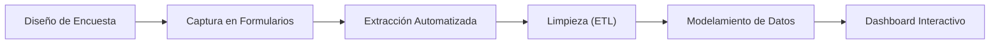
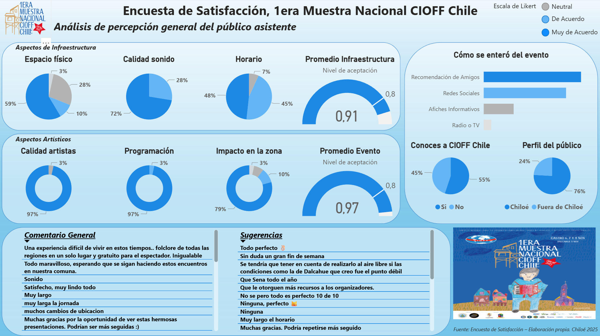
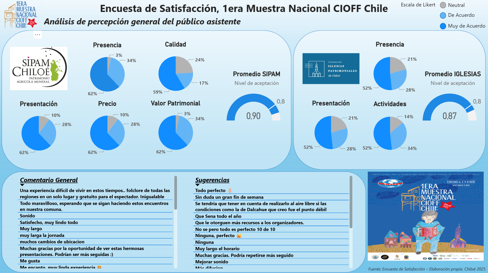

# 🎭 CIOFF Chile Survey Analytics

> Análisis de encuestas y visualización de datos para apoyar la mejora operativa y la experiencia en eventos folclóricos organizados por CIOFF Chile.

## 📝 Objetivo
Diseñar y desarrollar un proceso integral de captura, extracción, limpieza y análisis de datos provenientes de encuestas de satisfacción. El propósito es identificar oportunidades de mejora en la experiencia de los asistentes y apoyar la toma de decisiones estratégicas de los organizadores de los eventos.

## 📖 Contexto
CIOFF Chile es una organización dedicada a la realización de eventos y festivales folclóricos. Este proyecto nació de la necesidad de evaluar de manera estructurada la calidad de dichos eventos. Consistió en la generación de un instrumento de medición (encuesta), la automatización en la captura de las respuestas, la extracción de los datos hacia un repositorio central, su limpieza y el análisis posterior. 

El resultado final permitió a la directiva evaluar objetivamente la experiencia del público y obtener información confiable para optimizar esfuerzos logísticos y organizativos en futuras ediciones.

## 🎯 Problema
Históricamente, los organizadores carecían de una forma estructurada, centralizada y automatizada de recoger las opiniones de los asistentes. Al no consolidar las respuestas en tiempo real, resultaba complejo obtener hallazgos útiles que permitieran detectar deficiencias logísticas, medir el nivel de satisfacción y orientar mejoras operativas de forma ágil.

## 💡 Solución Desarrollada
Se implementó un proceso *end-to-end* (desde la recolección hasta el reporte) que incluyó:
- Diseño estructurado del instrumento de medición (encuesta).
- Automatización del flujo de captura de respuestas en tiempo real.
- Extracción automatizada de datos hacia un repositorio estructurado.
- Limpieza, normalización y preparación de la base de datos (ETL).
- Análisis descriptivo de los resultados.
- Visualización interactiva de los hallazgos a través de un dashboard gerencial.

## 🛠️ Herramientas Utilizadas
- **Recolección de Datos:** Formularios digitales *(Ej. Microsoft Forms / Google Forms)*.
- **Tratamiento de Datos:** Microsoft Excel y Power Query.
- **Análisis y Visualización:** Microsoft Power BI.
- **Metodología:** Business Intelligence orientado a la experiencia del cliente (CX).

## 🚀 Valor Entregado (Impacto del Proyecto)
El despliegue del dashboard y su posterior análisis permitieron a CIOFF Chile:
- **Identificar deficiencias:** Detectar cuellos de botella en la logística y puntos débiles en la percepción del público.
- **Mejorar procesos:** Tomar decisiones basadas en datos para ajustar la planificación de futuros festivales.
- **Optimizar esfuerzos:** Asignar recursos económicos y humanos a las áreas que el público valoró con menor puntaje.
- **Visibilidad:** Monitorear los resultados de forma clara, oportuna y dinámica.

## 🔄 Flujo de Captura y Análisis

## 👁️ Vista Previa del Proyecto

  
  

> **Nota:** Las imágenes mostradas corresponden a una versión adaptada para fines de portafolio y anonimizada.

## 📚 Documentación Adicional
- 🏢 [Contexto de negocio](docs/business-context.md)
- 📋 [Proceso de encuesta y captura](docs/survey-process.md)
- 📈 [Hallazgos e insights](docs/findings-and-insights.md)

## ⚠️ Consideraciones
Este repositorio presenta una **versión adaptada del caso real**. Para cumplir con la confidencialidad de la organización, no se exponen opiniones sensibles, datos personales de los encuestados, ni información interna reservada de la directiva de CIOFF Chile.

## 📫 Contacto
Si quieres conocer más sobre este proyecto o mi trabajo en automatización, levantamiento de encuestas y análisis de datos, puedes contactarme:
- 📧 **Email:** [claudio.duran.m@gmail.com](mailto:claudio.duran.m@gmail.com)
- 💼 **LinkedIn:** [Claudio Durán Molina](https://www.linkedin.com/in/claudio-duran-molina-41580677)
